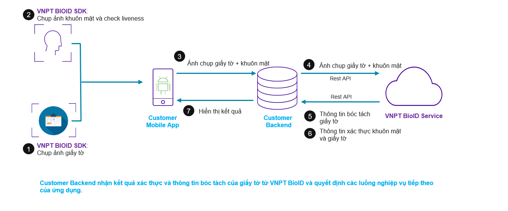
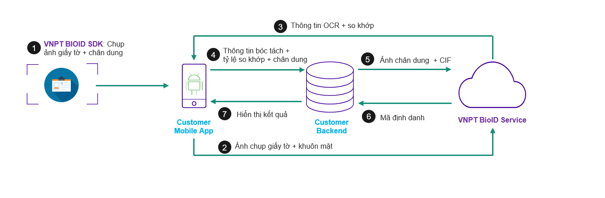

# Mô hình tích hợp

Hệ thống VNPT BioID hỗ trợ triển khai theo 02 mô hình onpremise và oncloud. Để đáp ứng được theo nhu cầu triển khai của khách hàng, VNPT khuyến nghị 02 mô hình triển khai như sau:

## 1. Mô hình 1: Backend to Backend

!!! info "Khuyến nghị"
        -   **VNPT** khuyến nghị khách hàng nên sử dụng mô hình **Backend to Backend** để đảm bảo khả năng `mở rộng nghiệp vụ`, `tính bảo mật`.
        
!!! warning "Cảnh báo về bảo mật"
        -   Giao tiếp giữa Mobile App và Customer Backend cần thực hiện [ký số bản tin](https://tools.ietf.org/id/draft-cavage-http-signatures-07.html) để tránh tấn công [Man-In-Midle-Attack](https://en.wikipedia.org/wiki/Man-in-the-middle_attack)
### 1.1. Thành phần  

* **Customer Mobile App**: Ứng dụng phục vụ người dùng cuối(*khách hàng của ngân hàng/các tổ chức*) giống như mobile banking, ...

* **Customer Backend**: Hệ thống nghiệp vụ của đơn vị tích hợp dịch vụ VNPT BioID. Xử lý các nghiệp vụ đặc thù và kết nối với hệ thống VNPT BioID để xử lý các yêu cầu về KYC.

* **VNPT VnptBioID Service**: VNPT BioID Platform, cung cấp các chức năng về eKYC, Biometrics

### 1.2. Luồng xử lý

1.  Khách hàng sử dụng **Customer Mobile App** thực hiện chụp ảnh chân dung và giấy tờ tùy thân:
2.  **Customer Mobile App** thông qua API gửi toàn bộ ảnh chụp lên **Customer Backend**.
3.  **Customer Backend** tiếp nhận yêu cầu, thực hiện xử lý nghiệp vụ và gọi **VNPT BioID Service** để yêu cầu các tác vụ về eKYC và Biometrics.
4.  **VNPT BioID Service** xử lý các yêu cầu KYC và Biometrics sau đó trả kết quả về cho **Customer Backend**
5.  **Customer Backend** dựa vào dữ liệu nhận được, xử lý các luồng nghiệp vụ đặc thù và trả kết quả xử lý về cho ứng dụng **Customer Mobile App**

## 2. Mô hình 2: Frontend to Backend

!!! info "Ưu điểm"
        -   Đối với mô hình **Frontend to Backend** hách hàng có thể tích hợp một cách `đơn giản`, `nhanh chóng` và `giảm thiểu nguồn lực phát triển`.
        
        
!!! warning "Cảnh báo về bảo mật"
        -   Khi thực hiện tích hợp, khách hàng cần chú ý có các cơ chế bảo vệ `ConsumerKey` và `ConsumerSecret` phục vụ giao tiếp với hệ thống **VNPT BioID** để tránh bị tấn công [Reverse Engineering](https://en.wikipedia.org/wiki/Reverse_engineering) lấy cắp thông tin xác thực.
        -   Giao tiếp giữa Mobile App, Customer Backend, VNPT BioID cần thực hiện [ký số bản tin](https://tools.ietf.org/id/draft-cavage-http-signatures-07.html) để tránh tấn công [Man-In-Midle-Attack](https://en.wikipedia.org/wiki/Man-in-the-middle_attack)

### 1.1. Thành phần  

* **Customer Mobile App**: Ứng dụng phục vụ người dùng cuối(*khách hàng của ngân hàng/các tổ chức*) giống như mobile banking, ...

* **Customer Backend**: Hệ thống nghiệp vụ của đơn vị tích hợp dịch vụ VNPT BioID. Xử lý các nghiệp vụ đặc thù và kết nối với hệ thống VNPT BioID để xử lý các yêu cầu về KYC.

* **VNPT VnptBioID Service**: VNPT BioID Platform, cung cấp các chức năng về eKYC, Biometrics

### 1.2. Luồng xử lý

1.  Khách hàng sử dụng **Customer Mobile App** thực hiện chụp ảnh chân dung và giấy tờ tùy thân:
2.  **Customer Mobile App** thông qua API gửi toàn bộ ảnh chụp lên **VNPT BioID Service**.
3.  **VNPT BioID Service** xử lý các yêu cầu KYC và Biometrics sau đó trả kết quả về cho **Customer Mobile App**
4.  **Customer Mobile App** gửi kết quả KYC đến **Customer Backend**
5.  **Customer Backend** dựa vào dữ liệu nhận được, xử lý các luồng nghiệp vụ đặc thù và trả kết quả xử lý về cho ứng dụng **Customer Mobile App**